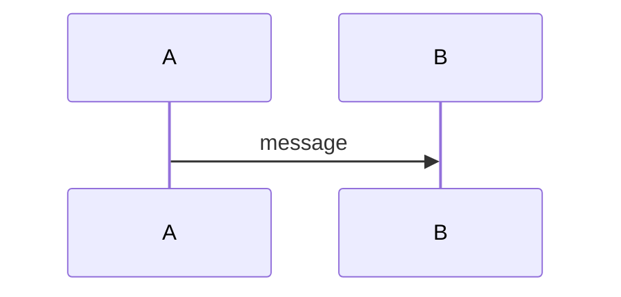

# AGENTS.md — docs/

> Guidance for AI coding assistants working in the `docs/` directory.
> Parent: [../AGENTS.md](../AGENTS.md)

## Overview

The `docs/` directory contains plain GitHub-Flavored Markdown (GFM) files.
There is no Docusaurus or other static-site generator here — the docs are
read directly on GitHub and locally. Keep that in mind when linking between
pages (use relative paths, not absolute URLs).

## Content structure

Follow the [Diataxis framework](https://diataxis.fr/) loosely:

- **Tutorials / quickstart** — getting started in minimal steps
- **How-to guides** — task-oriented (for example, adding a new vendor transform)
- **Reference** — schema tables, CLI flag lists, API shapes
- **Explanation / architecture** — why things are designed the way they are

Current pages:

| File | Type |
|---|---|
| `quickstart.md` | Tutorial |
| `architecture.md` | Explanation |
| `schema-reference.md` | Reference |
| `services/l3vpn.md` | How-to + Reference |
| `lab/containerlab.md` | How-to |
| `troubleshooting.md` | How-to |
| `AGENTS.md` | Meta |

## Markdown style

- GitHub-Flavored Markdown only — no MDX, no JSX, no HTML.
- Use `sentence case` for headings (lowercase except first word and proper nouns).
- Blank lines before and after every code block, table, and list.
- Specify a language identifier on every fenced code block.
- Link between pages using relative paths: `[architecture](architecture.md)`.
- Tables for reference content; avoid deeply nested lists.
- No trailing spaces. No bare URLs — wrap in `[text](url)`.

## Mermaid diagrams

Mermaid is supported in GitHub-rendered Markdown. Use it for sequence
diagrams and flow charts. Verify syntax before committing:



Common mistakes: forgetting the blank line before the closing fence,
or using unsupported Mermaid features (GitHub renders a subset).

## Code examples

- Use `bash` for shell commands.
- Use `python` for Python snippets.
- Use `yaml` for YAML.
- Use `text` for literal output / log lines.
- Prefer complete, runnable commands over partial fragments.

## Linting

If `vale` is installed:

```bash
vale docs/
```

`vale` is optional and not required to pass CI. If it is not installed,
skip it. Do not gate commits on a missing `vale` binary.

YAML lint still runs in CI:

```bash
uv run yamllint .
```

## Prohibited content

- No `TODO`, `TBD`, or `XXX` placeholders in committed files.
- No raw credential values — use `<your-token>` placeholders.
- No absolute filesystem paths that are specific to a developer's machine.
- No generated content that duplicates the code (for example, do not paste full
  Jinja2 templates into docs; link to the source file instead).

## When to update docs

Update documentation whenever:

- A new schema node is added to `schemas/sp/` — add a table row in
  `schema-reference.md`.
- A new vendor transform is added — add a row to the vendor table in
  `architecture.md` and a configuration snippet in `services/l3vpn.md`.
- A new check is added — add a row to the checks table in `services/l3vpn.md`.
- A new invoke task is added — add a row to the invoke table in `README.md`.
- The containerlab topology changes — update `lab/containerlab.md`.
- A new common failure mode is identified — add it to `troubleshooting.md`.

## Do not

- Create a Docusaurus or other static site here — keep it plain Markdown.
- Introduce npm or Node.js dependencies.
- Add images (screenshots) without a clear reference to what they show;
  prefer text descriptions and Mermaid diagrams.
