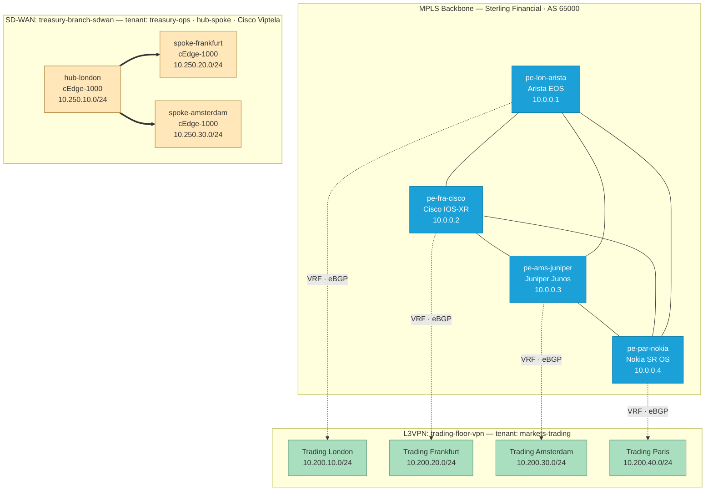

This page gets you from clone to a running demo in about 10 minutes.

## What you get out of the box

A multi-vendor MPLS backbone for **Sterling Financial** (the default `financial`
dataset), plus two pre-provisioned customer services that demonstrate the L3VPN
and SD-WAN catalog flows end to end.



**Backbone:** four PE routers, one per vendor (Arista, Cisco, Juniper, Nokia),
running ISIS + LDP + iBGP/VPNv4 in a single AS.

**L3VPN service (`trading-floor-vpn`):** a `markets-trading` tenant L3VPN
attached to all four PEs via eBGP, with one customer prefix per site in the
`10.200.0.0/16` supernet.

**SD-WAN service (`treasury-branch-sdwan`):** a `treasury-ops` hub-spoke overlay
on Cisco Viptela cEdge-1000 appliances at three of the same sites, with LAN
prefixes in the `10.250.0.0/16` supernet.

Both services are created on `invoke init` and you can build more from the
[Streamlit Service Catalog](#4-start-the-streamlit-service-catalog).

## Prerequisites

- Docker / Docker Compose
- Python 3.10+
- `uv` (https://docs.astral.sh/uv/)
- (Optional) containerlab >= 0.50

## 1. Clone and install

```bash
git clone https://github.com/opsmill/infrahub-demo-sp.git
cd infrahub-demo-sp
cp .env.example .env
uv sync
```

Open `.env` and review the values — see [Configuration](#configuration)
below for what each variable does. The defaults are fine for a local
demo; you typically only edit `INFRAHUB_SERVICE_CATALOG` (to enable the
Streamlit sidecar) and `INFRAHUB_DATASET` (to switch tenant theme).

## 2. Start Infrahub and bootstrap data

```bash
uv run invoke init
```

This destroys any prior state, starts the containers, loads the schemas,
the menu, all bootstrap objects (4 PEs, full backbone, resource pools,
plus the selected customer-facing dataset), and generates schema
protocol bindings.

Wait ~30 s after the containers come up before bootstrap runs.

## 3. Open the Infrahub UI

Visit http://localhost:8000 — log in with `admin` / `infrahub`. The
sidebar menu shows **Service Catalog → L3 VPNs**, **Topology → MPLS
Backbones**, and **MPLS** (ISIS / LDP / MP-BGP processes).

## 4. Start the Streamlit Service Catalog

Set `INFRAHUB_SERVICE_CATALOG="true"` in `.env`, then run:

```bash
uv run invoke start
```

Every `invoke start` / `invoke init` will now also build and start the
Streamlit sidecar. Visit http://localhost:8501. Create your first L3VPN.

The Service Catalog also exposes a second wizard — **Create SD-WAN
service** — for provisioning Cisco Viptela or Versa Networks SD-WAN
overlays. The flow mirrors Create L3VPN: pick vendor and topology, list
the sites, submit. See [services/sdwan](./services/sdwan.mdx) for the
lifecycle, vendor differences, and known gaps.

## 5. (Optional) Bring up the containerlab

See [`lab/containerlab`](./lab/containerlab.mdx).

## Configuration

All configurable behaviour is driven by environment variables in `.env`
(loaded with `set -a; source .env; set +a` before any `uv run invoke`
command). `uv run invoke info` prints the resolved values.

| Variable | Default | Effect |
|---|---|---|
| `INFRAHUB_ADDRESS` | `http://localhost:8000` | Where the SDK / Streamlit catalog reach the server |
| `INFRAHUB_API_TOKEN` | demo token | Authentication. Rotate before any non-local use |
| `INFRAHUB_UI_URL` | `http://localhost:8000` | Used by the Streamlit catalog for "open in Infrahub" links |
| `INFRAHUB_GIT_LOCAL` | `false` | `true` registers a `CoreRepository` pointed at the bind-mounted `/upstream` (no GitHub clone needed). `false` registers a `CoreReadOnlyRepository` against the public GitHub repository |
| `INFRAHUB_SERVICE_CATALOG` | `false` | `true` builds + starts the Streamlit sidecar on every `invoke start` / `invoke init` |
| `INFRAHUB_DATASET` | `financial` | Customer-facing tenant overlay loaded on top of the shared backbone. One subdirectory of `objects/datasets/`. Ships with `financial` (internal bank, 8 division tenants, `trading-floor-vpn`) and `isp` (Lumina Networks pan-European ISP, 8 customer tenants, `kestrel-bank-mpls`) |
| `INFRAHUB_ENTERPRISE` | `false` | `true` streams the Enterprise edition compose file from `https://infrahub.opsmill.io/enterprise/<INFRAHUB_VERSION>` instead of the Community one. Requires an Enterprise license / pull credentials |
| `INFRAHUB_VERSION` | `stable` | Compose file version tag pulled from `infrahub.opsmill.io` (use `latest`, `stable`, or a specific release like `1.4.0`) |
| `INFRAHUB_PORT` | `8000` | Override the Infrahub server port |
| `PREFECT_PORT` | `4200` | Override the Prefect task-manager port |
| `STREAMLIT_PORT` | `8501` | Override the Streamlit catalog port |

To switch dataset:

```bash
# in .env
INFRAHUB_DATASET="isp"
```

…then `uv run invoke init` to wipe and reload from the new dataset.

## Troubleshooting

See [`troubleshooting`](./troubleshooting.mdx).
